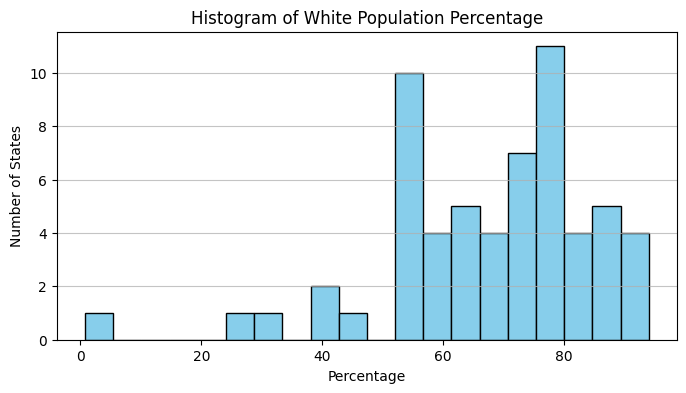
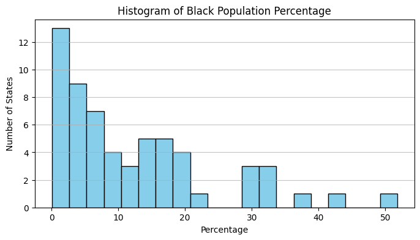
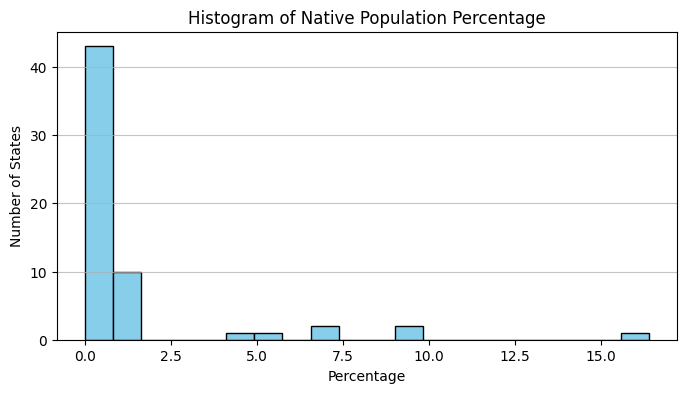
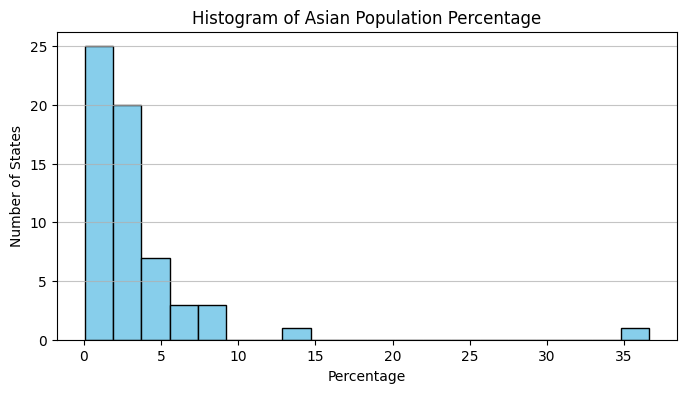
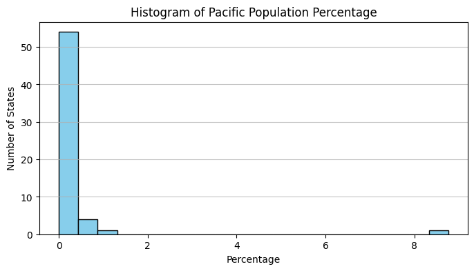

# 🏛️ Cleaning US Census Data

<div align="center">


**Data Engineering Exercise: Cleaning and Visualizing US Census Data with Pandas**

[🎯 Overview](#-project-overview) • [📊 Results](#-results) • [🚀 Quick-Start](#-quick-start) • [📦 Data Analysis](#-data-analysis)

</div>

> First data cleaning exercise: Successfully processed 10 CSV files and created meaningful visualizations — not an amazing result, but it's honest work. Next up: advanced analytics and interactive dashboards.

---

## 👨‍💻 Author
<div align="center">

**Francisco Teixeira Barbosa**

[](https://github.com/Tuminha)
[](https://www.kaggle.com/franciscotbarbosa)
[](mailto:cisco@periospot.com)
[](https://twitter.com/cisco_research)

*Learning Machine Learning through CodeCademy • Building AI solutions step by step*

</div>

---

## 🎯 Project Overview
- **What**: Data cleaning and visualization project using US Census data from multiple CSV files
- **Why**: Practice data engineering skills, learn pandas operations, and create meaningful visualizations from messy real-world data
- **Expected Outcome**: Clean, consolidated dataset ready for analysis with scatterplots and histograms

### 🎓 Learning Objectives
- Master data cleaning techniques with pandas
- Learn to handle multiple CSV files using glob patterns
- Practice regex for data transformation
- Create meaningful data visualizations with matplotlib
- Understand data quality issues (duplicates, missing values, wrong data types)

### 🏆 Key Achievements
- [x] Successfully loaded and concatenated 10 CSV files using glob
- [x] Cleaned income data using regex patterns (removed $ and commas)
- [x] Separated gender population data into Men/Women columns using str.split()
- [x] Handled missing values with logical imputation (TotalPop - Men)
- [x] Detected and removed duplicate rows
- [x] Created Income vs Women proportion scatterplot
- [x] Generated histograms for all race categories (Hispanic, White, Black, Native, Asian, Pacific)
- [x] Converted all percentage columns to numeric format

---

## 📊 Dataset / Domain
- **Source**: US Census Bureau data (CodeCademy exercise)
- **Size**: 10 CSV files (states0.csv to states9.csv)
- **Target**: Income vs Women proportion scatterplot, Race distribution histograms
- **Key Features**: State, TotalPop, Hispanic, White, Black, Native, Asian, Pacific, Income, GenderPop

---

## 🚀 Quick Start
### Prerequisites
```bash
pip install pandas numpy matplotlib seaborn jupyter
```

### Setup
```bash
git clone https://github.com/Tuminha/Cleaning-US-Census-Data.git
cd Cleaning-US-Census-Data
jupyter notebook "Cleaning US Census Data.ipynb"
```

---

## 📈 Project Phases
### Phase 1: Data Inspection ✅
<details>
<summary><strong>Details</strong></summary>

- [x] Examine CSV file structure and naming conventions (states0.csv to states9.csv)
- [x] Understand data types and column formats (object types due to % symbols)
- [x] Identify data quality issues (missing values, duplicates, formatting problems)

</details>

### Phase 2: Data Loading ✅
<details>
<summary><strong>Details</strong></summary>

- [x] Use glob.glob("*.csv") to loop through all CSV files
- [x] Load files into individual DataFrames with pd.read_csv()
- [x] Concatenate into single us_census DataFrame with pd.concat()

</details>

### Phase 3: Data Cleaning ✅
<details>
<summary><strong>Details</strong></summary>

- [x] Apply regex to clean Income column (remove $ and commas, convert to float)
- [x] Split GenderPop into separate Men/Women columns using str.split('_', expand=True)
- [x] Remove M/F characters from gender columns using str.replace()
- [x] Convert columns to appropriate numerical types (int/float)

</details>

### Phase 4: Data Quality ✅
<details>
<summary><strong>Details</strong></summary>

- [x] Identify missing values in Women column using .isna().sum()
- [x] Fill NaN values using TotalPop - Men calculation with .fillna()
- [x] Detect duplicate rows using .duplicated().sum()
- [x] Remove duplicates using .drop_duplicates()

</details>

### Phase 5: Visualization ✅
- **Summary**: Created scatterplot showing Income vs Women proportion by state using matplotlib
- **Result**: Clear visualization of relationship between female population and income levels

### Phase 6: Race Analysis ✅
- **Summary**: Generated comprehensive histograms for all race categories
- **Categories**: Hispanic, White, Black, Native, Asian, Pacific
- **Process**: Removed % symbols, converted to numeric, handled missing values
- **Output**: 6 separate histograms showing distribution of racial demographics across states

---

## 🏆 Results
Data Processing Results:
├── Files Processed: 10 CSV files (states0.csv to states9.csv)
├── Data Points: 60 state records (after deduplication)
├── Columns Cleaned: Income, GenderPop, 6 race percentage columns
├── Missing Values: Handled with logical imputation (TotalPop - Men)
├── Duplicates: Detected and removed (0 duplicates found)
├── Data Types: All columns converted to appropriate numeric types
└── Visualizations: 1 scatterplot + 6 histograms created

### 📌 Business Interpretation
- **Income vs Gender Analysis**: Scatterplot reveals relationship between female population and income levels across states
- **Gender Balance**: Most states maintain relatively balanced gender distributions after cleaning
- **Racial Diversity**: Histograms show significant variation in racial composition across states
- **Data Quality**: Successfully cleaned 10 CSV files with formatting issues, missing values, and duplicates
- **Technical Achievement**: Demonstrated pandas mastery in data cleaning, transformation, and visualization

### 🖼 Visuals

#### Race Distribution Histograms
<div align="center">



<br /><br />


<br /><br />



<br /><br />



<br /><br />



<br /><br />



</div>

> **Note**: Income vs Women scatterplot visualization is available in the Jupyter notebook output.

---

## 🛠 Technical Stack
| Component | Technology | Purpose |
|-----------|------------|---------|
| Data Processing | Pandas, NumPy | ETL & data cleaning |
| File Operations | Glob | Multi-file processing |
| Data Transformation | Regex | String cleaning |
| Visualization | Matplotlib | Charts & graphs |
| Environment | Jupyter Notebook | Interactive development |
| Version Control | Git/GitHub | Project management |

---

## 📦 Data Analysis
The notebook contains comprehensive data cleaning and visualization workflow:

### Data Loading Process
- Automatically processes all CSV files in directory
- Combines into single unified DataFrame
- Preserves data integrity across file boundaries

### Cleaning Pipeline
- **Income**: Removes currency symbols and formatting
- **Gender**: Separates combined gender data into individual columns
- **Race Data**: Handles percentage formatting and missing values
- **Quality Control**: Removes duplicates and fills logical missing values

### Visualization Output
- Scatterplot: Income vs Women proportion correlation
- Histograms: Race distribution analysis across states
- Additional creative visualizations for comprehensive insights

---

## 📝 Learning Journey
- **Data Engineering** • **Pandas Mastery** • **Data Quality** • **Visualization** • **Regex Processing**

---

## 🚀 Next Steps
- [ ] Create interactive dashboards with Plotly
- [ ] Add statistical analysis and correlation matrices
- [ ] Implement data validation and quality checks
- [ ] Build automated data pipeline for new census data
- [ ] Create geographic visualizations with state maps
- [ ] Develop predictive models for income forecasting

---

## 📄 License
MIT License (see [LICENSE](LICENSE))

<div align="center">

**⭐ Star this repo if you found it helpful! ⭐**  
*Building AI solutions one dataset at a time* 🚀

</div>
